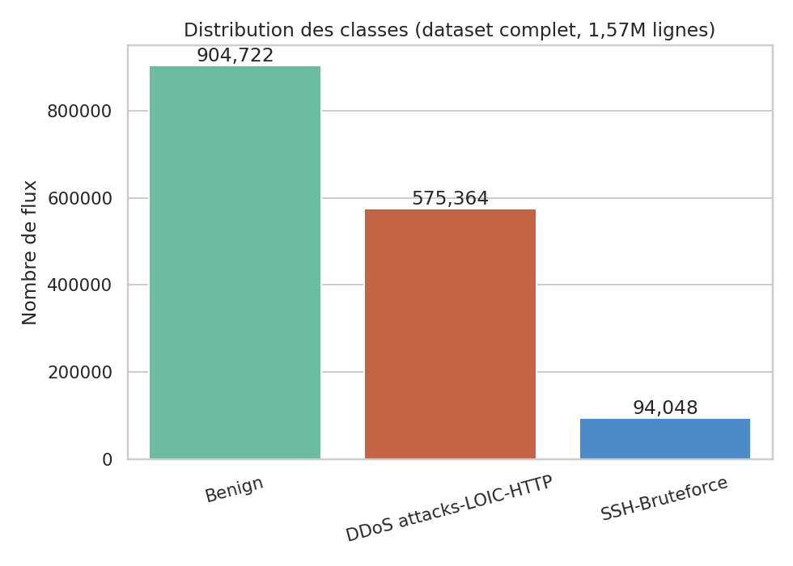
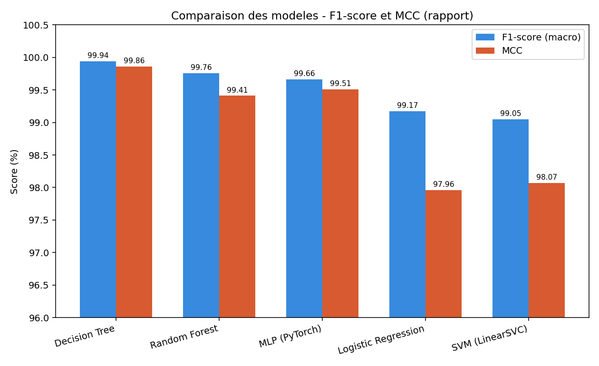
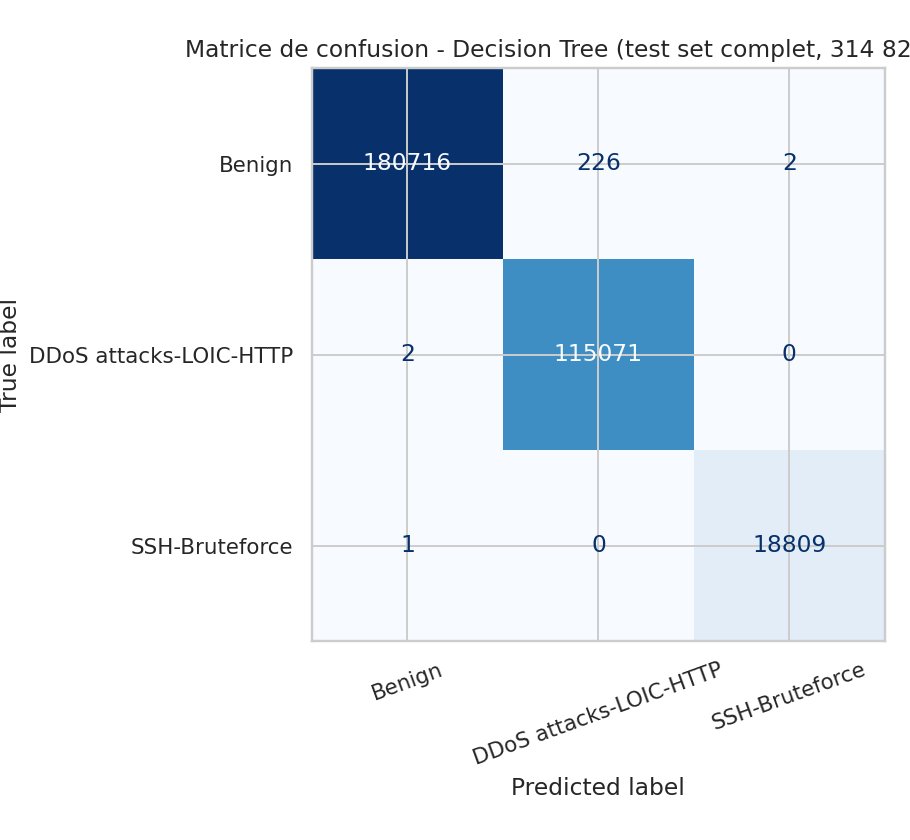
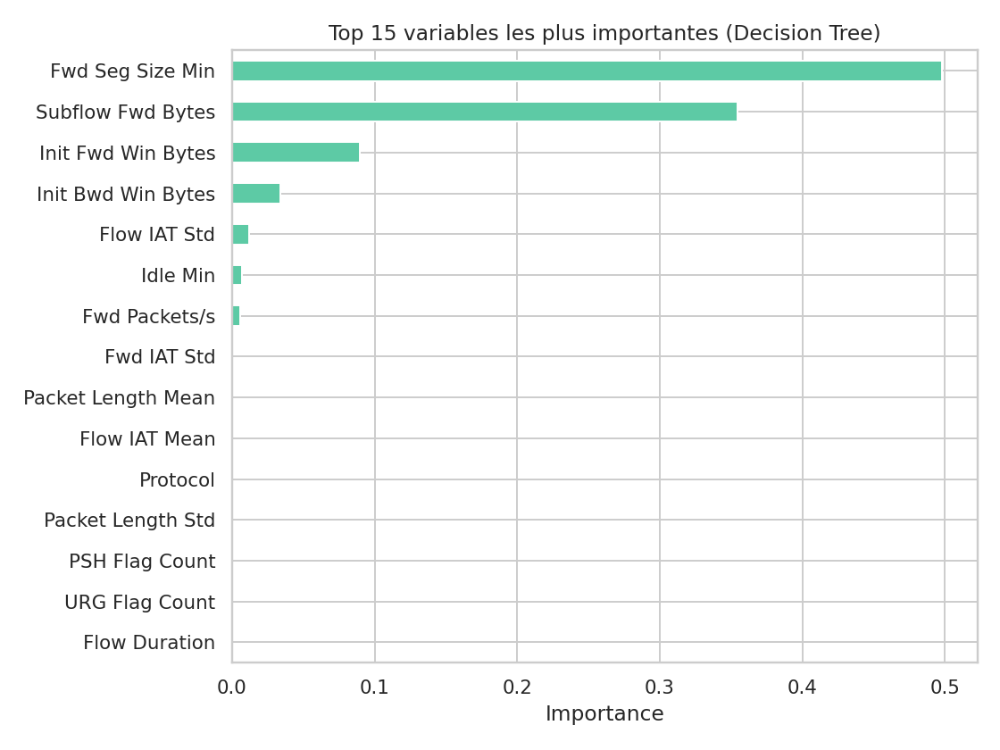

# Cloud Intrusion Detection — CSE-CIC-IDS2018

Machine Learning-based intrusion detection in a cloud environment using the CSE-CIC-IDS2018 dataset.

> Détection d'intrusions dans un environnement Cloud par Machine Learning : étude et déploiement
> sur le dataset **CSE-CIC-IDS2018**. Comparaison de 5 algorithmes de classification supervisée
> (Decision Tree, Random Forest, Logistic Regression, SVM, MLP) et déploiement du meilleur
> modèle via une API REST conteneurisée (FastAPI + Docker).


> **Ce dépôt contient les notebooks originaux du projet, tels quels et déjà exécutés** : les
> résultats affichés dedans (`notebooks/`) sont réels, calculés sur le dataset complet
> (1,57M lignes) par les auteures — aucune ré-exécution n'est nécessaire pour les consulter.
> Pour que le dépôt reste léger, seuls des **échantillons** de données sont inclus dans `data/`
> ; le dataset complet est disponible via le lien officiel donné dans `data/README.md`.

---

## Table des matières

1. [Contexte](#contexte)
2. [Dataset](#dataset)
3. [Structure du dépôt](#structure-du-dépôt)
4. [Méthodologie](#méthodologie)
5. [Résultats](#résultats)
6. [Installation](#installation)
7. [Utilisation](#utilisation)
8. [Déploiement (API + Docker)](#déploiement-api--docker)
9. [Limites et perspectives](#limites-et-perspectives)
10. [Références](#références)

---

## Contexte

Le développement rapide des infrastructures Cloud s'accompagne d'une exposition accrue aux
menaces réseau : attaques par déni de service distribué (**DDoS**), attaques par force brute
(**Brute Force**), intrusions discrètes, etc. Les systèmes de détection d'intrusions (**IDS**)
traditionnels, basés sur des signatures connues, montrent leurs limites face à des menaces
nouvelles. Ce projet explore une approche par **Machine Learning** : entraîner un modèle à
reconnaître un comportement de trafic malveillant directement à partir de caractéristiques de
flux réseau, sans base de signatures figée.

Le pipeline complet est mis en œuvre — de l'exploration des données jusqu'au déploiement d'une
API de prédiction conteneurisée — sur le dataset de référence **CSE-CIC-IDS2018**
(Sharafaldin, Lashkari & Ghorbani, 2018).

## Dataset

[**CSE-CIC-IDS2018**](https://www.unb.ca/cic/datasets/ids-2018.html) est un jeu de données de
trafic réseau développé conjointement par le *Communications Security Establishment* (CSE) et
le *Canadian Institute for Cybersecurity* (CIC). Le trafic brut est transformé en caractéristiques
statistiques de flux (durée, nombre de paquets, taille, temps entre paquets, etc.) via
**CICFlowMeter**.

Deux fichiers du dataset sont utilisés dans ce projet. Un échantillon léger de chacun est inclus
dans `data/raw/` (voir `data/README.md` pour le lien officiel vers le dataset complet) :

| Fichier | Date | Trafic | Lignes (dataset complet) |
|---|---|---|---|
| `DDoS1-Tuesday-20-02-2018...parquet` | 20/02/2018 | Benign + DDoS attacks-LOIC-HTTP | 954 846 |
| `Bruteforce-Wednesday-14-02-2018...parquet` | 14/02/2018 | Benign + SSH-Bruteforce + FTP-BruteForce | 619 346 |

Après fusion, nettoyage et sélection de variables, le dataset complet (utilisé pour produire les
résultats de ce README et des notebooks) compte **1 574 187 lignes**, **36 variables
explicatives** + `Label`.



## Structure du dépôt

```
cloud-intrusion-detection-cicids2018/
├── data/
│   ├── raw/                          # echantillons des 2 fichiers CICFlowMeter (78 colonnes)
│   │   ├── DDoS1-Tuesday-20-02-2018_TrafficForML_CICFlowMeter.parquet
│   │   └── Bruteforce-Wednesday-14-02-2018_TrafficForML_CICFlowMeter.parquet
│   ├── sample_flows.parquet          # echantillon pretraite (18k lignes) pour tests rapides
│   └── README.md                     # lien officiel pour le dataset complet (1,57M lignes)
├── notebooks/
│   ├── 01_EDA.ipynb                  # exploration, nettoyage, feature selection (deja execute)
│   └── 02_preprocessing_and_modeling.ipynb   # encodage, split, scaling, 4 modeles (deja execute)
├── images/                            # visualisations generees a partir des vraies donnees/modele
├── models/                            # artefacts du modele retenu (Decision Tree)
│   ├── decision_tree_model.pkl
│   ├── scaler.pkl
│   ├── label_encoder.pkl
│   └── feature_names.json
├── deployment/                        # API de prediction (chapitre 4 du rapport)
│   ├── app/
│   │   ├── main.py                   # routes FastAPI (/, /health, /predict)
│   │   └── model_loader.py
│   ├── Dockerfile
│   └── requirements.txt
├── train.py                           # script d'entrainement reproductible (CLI)
├── requirements.txt
└── README.md
```

## Méthodologie

Pipeline en six étapes (détail complet dans `notebooks/`, code et résultats réels) :

1. **Collecte et fusion** des deux fichiers de flux réseau (format Parquet, CICFlowMeter)
2. **Nettoyage** : suppression de 10 colonnes constantes, 5 lignes à durée de flux négative,
   12 012 doublons exacts, et de la classe `FTP-BruteForce` (53 exemples, non exploitable)
3. **Sélection de variables** : 31 colonnes redondantes retirées (corrélation > 0,9, sur la base
   de l'importance Random Forest) → 68 → 37 colonnes
4. **Encodage / split / normalisation** : `LabelEncoder`, split stratifié 80/20,
   `StandardScaler` ajusté sur le train uniquement (pas de fuite de données). Le déséquilibre
   résiduel (~9,6:1) est géré via `class_weight="balanced"` — SMOTE testé mais non retenu
   (aucun gain observé)
5. **Modélisation** : 5 algorithmes entraînés et évalués sur les mêmes données prétraitées —
   Decision Tree, Random Forest, Logistic Regression, SVM (LinearSVC), MLP (PyTorch)
6. **Diagnostic de fuite de données** : avant d'accepter les scores très élevés obtenus,
   plusieurs vérifications ont été menées (doublons résiduels, recherche d'une variable
   parfaitement séparatrice, répartition de l'importance des variables, validation croisée
   stratifiée à 5 blocs) — voir le rapport complet, section 3.5

## Résultats

| Modèle | Accuracy | Précision | Rappel | F1-score | AUC-ROC | MCC | Temps entraînement |
|---|---|---|---|---|---|---|---|
| **Decision Tree** | **99,93 %** | **99,93 %** | **99,96 %** | **99,94 %** | 99,96 % | **99,86 %** | **30,7 s** |
| Random Forest | 99,68 % | 99,72 % | 99,80 % | 99,76 % | **100,00 %** | 99,41 % | 151,5 s |
| MLP (PyTorch) | 99,74 % | 99,49 % | 99,84 % | 99,66 % | **100,00 %** | 99,51 % | — |
| Logistic Regression | 98,89 % | 99,01 % | 99,35 % | 99,17 % | 99,94 % | 97,96 % | — |
| SVM (LinearSVC) | 98,96 % | 98,77 % | 99,35 % | 99,05 % | 99,94 % | 98,07 % | — |

*(Résultats mesurés sur le dataset complet, 1,57M lignes, split de test stratifié à 20 % — voir
`notebooks/02_preprocessing_and_modeling.ipynb` pour le détail complet de chaque modèle.)*

Le **Decision Tree** offre le meilleur compromis performance / légèreté (F1-score le plus
élevé, temps d'entraînement 5× plus court que Random Forest) : c'est le modèle intégré dans
l'API de déploiement.



Les erreurs résiduelles se concentrent presque exclusivement entre `Benign` et
`SSH-Bruteforce` (classes les plus proches statistiquement), tandis que
`DDoS attacks-LOIC-HTTP` est quasi parfaitement isolée :





> **Note méthodologique** — des scores aussi élevés (>99%) sont documentés dans la littérature
> sur ce dataset (Leevy & Khoshgoftaar, 2020) et reflètent une forte séparabilité intrinsèque
> à CSE-CIC-IDS2018 plutôt qu'une erreur d'implémentation. Des travaux plus récents
> (Cantone et al., 2024) montrent cependant qu'un modèle performant en évaluation interne peut
> voir sa performance chuter fortement sur un dataset externe : une validation sur du trafic
> réel non vu à l'entraînement resterait nécessaire avant tout déploiement en production.

## Installation

```bash
git clone https://github.com/<votre-utilisateur>/cloud-intrusion-detection-cicids2018.git
cd cloud-intrusion-detection-cicids2018

python -m venv .venv
source .venv/bin/activate   # Windows : .venv\Scripts\activate

pip install -r requirements.txt
```

## Utilisation

### Consulter les résultats (rien à exécuter)

Les notebooks sont fournis **déjà exécutés**, avec les vrais résultats du rapport (calculés sur
le dataset complet). Ouvrez-les directement sur GitHub ou dans Jupyter pour consulter l'analyse
et les résultats sans rien lancer :

- `notebooks/01_EDA.ipynb` — exploration, nettoyage, analyse des corrélations et des outliers,
  sélection de variables
- `notebooks/02_preprocessing_and_modeling.ipynb` — encodage, split, scaling, entraînement et
  comparaison des 5 modèles avec matrices de confusion détaillées

### Ré-entraîner le modèle retenu (CLI)

```bash
# Decision Tree sur l'echantillon fourni (data/sample_flows.parquet)
python train.py --data data/sample_flows.parquet

# Sur le dataset complet (a telecharger, voir data/README.md) -> reproduit exactement
# les chiffres du rapport (Accuracy 99.93%, F1 99.94%, MCC 99.86%)
python train.py --data data/df_selected.parquet
```

## Déploiement (API + Docker)

Le modèle Decision Tree est exposé via une API REST (FastAPI), conteneurisée avec Docker.

```bash
# Local
cd deployment && pip install -r requirements.txt
uvicorn app.main:app --reload --host 0.0.0.0 --port 8000

# Docker (depuis la racine du depot)
docker build -t ids-api:latest -f deployment/Dockerfile .
docker run -d -p 8000:8000 --name ids-api-container ids-api:latest
```

Documentation interactive Swagger : `http://127.0.0.1:8000/docs`

| Route | Description |
|---|---|
| `GET /` | Message d'accueil + classes possibles |
| `GET /health` | Vérification que le modèle est chargé |
| `POST /predict` | Classifie un flux réseau (36 features en entrée) |

## Limites et perspectives

- **Généralisation** : une performance quasi parfaite sur ce dataset ne garantit pas une
  performance équivalente face à du trafic réseau réel non vu à l'entraînement ; une
  évaluation sur un dataset externe (ex. LycoS-IDS-2017) serait nécessaire avant tout
  déploiement en conditions réelles.
- **Déploiement Cloud distant** : une tentative de déploiement sur une instance OpenStack a été
  entreprise mais s'est heurtée à un problème de connectivité SSH ; l'API reste pleinement
  fonctionnelle en local / conteneurisée (Docker Desktop).
- **Pistes d'amélioration** : intégrer davantage de catégories d'attaques du dataset complet
  (infiltration, botnet, web attacks), appliquer effectivement SMOTE, évaluer la robustesse sur
  un découpage temporel plutôt qu'aléatoire, simuler un flux entrant en continu pour une
  détection « en direct ».

## Références

1. Sharafaldin, I., Lashkari, A. H., & Ghorbani, A. A. (2018). *Toward Generating a New
   Intrusion Detection Dataset and Intrusion Traffic Characterization.* ICISSP.
2. Leevy, J. L., & Khoshgoftaar, T. M. (2020). *A survey and analysis of intrusion detection
   models based on CSE-CIC-IDS2018 Big Data.* Journal of Big Data, 7(1), 104.
3. Cantone, M., Marchetti, M., Colajanni, M. et al. (2024). *Analyse de la généralisation
   inter-datasets des modèles de détection d'intrusions entraînés sur CSE-CIC-IDS2018.*
4. Pedregosa, F. et al. (2011). *Scikit-learn: Machine Learning in Python.* JMLR, 12, 2825-2830.
5. Paszke, A. et al. (2019). *PyTorch: An Imperative Style, High-Performance Deep Learning
   Library.* NeurIPS 32.
6. [Documentation officielle FastAPI](https://fastapi.tiangolo.com/)
7. [Documentation officielle Docker](https://docs.docker.com/)

---

## Auteure

- Maryame Houssayni

## Licence

Ce projet est à réalisé dans le cadre du Master IAC (Intelligence Artificielle et Cybersécurité).


